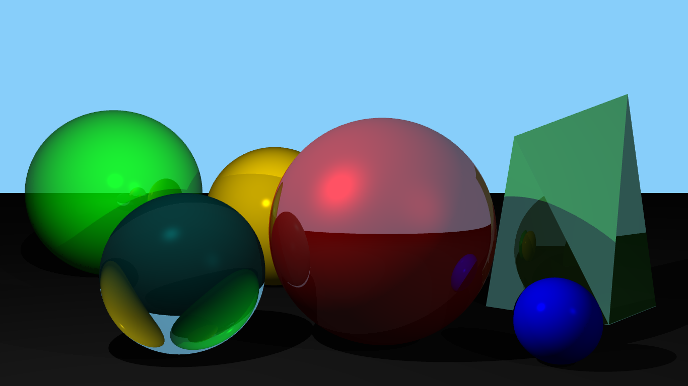
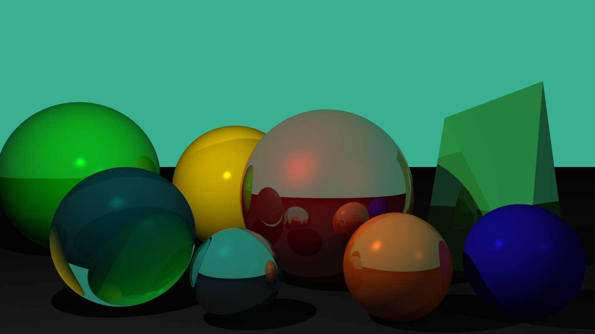
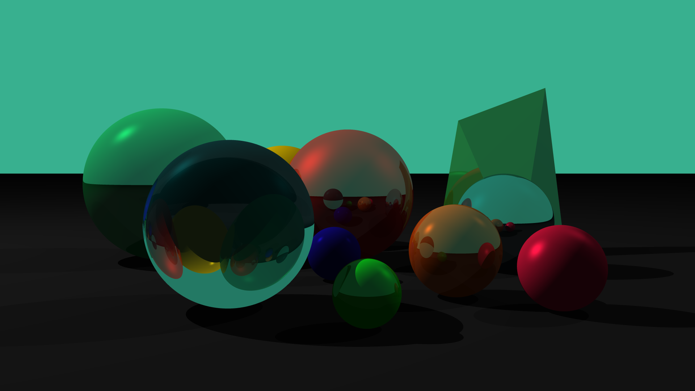

### My skills and knowledge
| | |
|:---:|:---:|
| Programming languages: | C, C++, Python, C# |
| Libraries: | NumPu, SciPy, Scikit-learn, MatPlotlib, Seaborn, Pandas, Qt/PyQt, OpenGL(GLSL, GLM, freeglut, glfw), OpenCV, NASM |
| Technologies: | Linux, GDB, Git, LaTeX, OpenMP, gnuplot, cmake |
<!--
# Ray tracing project
___
| |
|:-------------------:|
||
___

___

___

___
**AstonMartinN/AstonMartinN** is a ✨ _special_ ✨ repository because its `README.md` (this file) appears on your GitHub profile.
Here are some ideas to get you started:

- 🔭 I’m currently working on ...
- 🌱 I’m currently learning ...
- 👯 I’m looking to collaborate on ...
- 🤔 I’m looking for help with ...
- 💬 Ask me about ...
- 📫 How to reach me: ...
- 😄 Pronouns: ...
- ⚡ Fun fact: ...
-->
